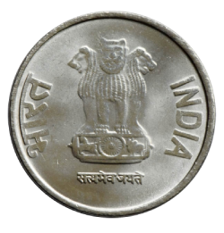
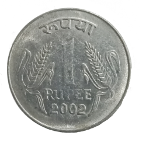

# 🪙 Coin Flip Game

Welcome to the **Coin Flip Game**, a simple and responsive React application that simulates flipping a coin. The app visually displays results and tracks heads, tails, and total flips — all with smooth animations.

## 🚀 Live Demo

🔗 [View Live](https://react-quiz-game-zeta.vercel.app/)

---

## 📸 Screenshots


> Head Coin


> Tail Coin

---

## 🧠 Features

- 🎯 Flip a virtual coin with a single click
- 🖼 Displays head or tail image with a smooth animation
- 📊 Tracks:
  - Number of heads
  - Number of tails
  - Total number of flips
- 🕹 Prevents re-flipping while animation is in progress
- 📱 Fully responsive across devices (mobile, tablet, desktop)

---

## 📁 Project Structure
```bash
CoinFlipGame/
├── public/
│ ├── head-coins.png
│ └── tail-coins.png
├── src/
│ ├── Components/
│ │ ├── Coin/
│ │ │   ├── Coin.js
│ │ │   └── Coin.css
│ │ └── FlipCoin/
│ │     ├── FlipCoin.js
│ │     └── FlipCoin.css
│ ├── App.js
│ ├── App.css
│ ├── index.css
│ └── main.jsx
├── package.json
└── README.md
```

---

## 🛠️ Tech Stack

- **React** – Frontend library
- **CSS** – Styling and animations
- **Responsive Design** – Mobile-friendly layout

---

## 🔧 Getting Started

```bash
git clone https://github.com/your-username/coin-flip-game.git
cd coin-flip-game
npm install
npm run dev
```

Open your browser and go to: http://localhost:5173

---

## 🧩 Component Overview
`App.js`
- Top-level wrapper that renders the game heading and FlipCoin component.

`FlipCoin.js`
- Contains state logic for:
    - Current coin face
    - Flip count
    - Head count
    - Animation status
- Handles the coin flipping animation and state updates.

`Coin.js`
- Displays the current face (head or tail) image based on props.

---

## 🎨 Styling
Each component has its own scoped CSS:
- `App.css` – Global layout and typography
- `FlipCoin.css` – Flip animation and layout
- `Coin.css` – Image styling and effects

> ✅ The layout is fully responsive across different screen sizes.

---

## 📈 Future Enhancements
- 🔊 Add coin flip sound effects
- 🧾 Flip history tracker
- 📉 Win ratio or head/tail probability
- 🎨 Theme customization (dark/light mode)

---

## 🧑‍💻 Author
Made with ❤️ by Surender Gupta

---

## 📃 License
This project is licensed under the MIT License.
